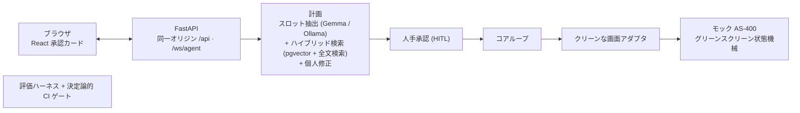

# Tanomude

[English](./README.md) · **日本語**

自然言語の指示でレガシー基幹システムを操作する、人手承認（ヒューマン・イン・ザ・ループ）型のAIエージェント。完全オンプレミスで動作し、すべての操作は人の承認を経てから実行され、追記専用の監査証跡に記録されます。

> **デモ動画 — 近日公開**

[OpenClaw](https://github.com/openclaw/openclaw) を基盤に構築。

---

## 概要

- **RAGエージェント** — 自然言語の依頼を、検索した手順書に根拠づけて具体的な計画に変換します。
- **評価ハーネス** — 計画・検索・ガードレールをリポジトリ内のスイートで採点し、その決定論的サブセットを全プルリクエストの必須チェックとして実行します。
- **ガードレール（LLMOps）** — モデルの応答はすべて検証付きの構造化出力契約であり、3階層の上書き優先順位と測定済みの境界テストで統制されます。
- **人手承認（HITL）** — 人の明示的な承認なしに、操作がレガシーシステムへ届くことはありません。
- **オンプレミス** — ローカルモデル（Ollama 上の Gemma）、ローカル埋め込み、ローカルDB。データは社外に出ません。
- **監査ログ** — 承認の判断、ステップ単位の実行タイムライン、修正履歴を永続化します。

## アーキテクチャ



エージェントは **提案** し、人が **決定** します。承認された計画だけが実行され、狭いアダプタ越しにキー単位でレガシーシステムへ再生されます。

## できること（測定値）

以下の数値は、リポジトリ内の評価ハーネスを（埋め込みサービスありで）フル実行した結果です。そのスイートの決定論的サブセットが、全プルリクエストのゲートになります。

| 観点 | 結果 |
|---|---|
| 計画 — 成功率・ルーティング・フィールド精度 | 1.0 |
| 検索 — recall@3・precision@expected・MRR | 1.0 |
| 個人修正による育成 — Δ（推論ティアの方針スロット） | +1.0 |
| 境界尊重 — 修正が根拠づいた入力を上書きしないこと | 0.75 |

**上書きの統制方法。** 入力は **明示入力 → 個人修正 → 手順書ルール／推論デフォルト** の3階層で解決され、その境界は主張ではなく測定で示します。

- **構造化フィールドは硬。** 操作者がフォーム欄に入力した値が最優先です。
- **指示文に埋もれた言及は軟** — 妥当な範囲で尊重しますが、個人修正で動かし得ます。正直な 0.75 はここから来ます。すべての軟ケースが保たれるわけではありません。
- **人手承認が最終防御。** モデルが何を提案しても、人が承認するまで実行されません。

## クイックスタート

```bash
git clone <repo> && cd tanomude
docker compose up
```

その後 **http://localhost:8000** を開きます。

> 初回起動はイメージのビルドとローカルモデル（約9.6GB）のダウンロードを含むため、高速回線で約10分、低速回線ではそれ以上かかります。以降はキャッシュされます。

### 正直な結果表示

実行は4つの状態のいずれかに解決し、タイムラインに率直に表示されます。

- **送信済** — レコードが作成され、タイムラインにその ID を表示します。
- **再入力／コード確認** — 入力されたコードがレガシーシステムの検証を通らず、確認と再入力が必要です。
- **要調査** — 一時的・実行環境側の事象で、リトライを尽くした場合です。
- **却下** — 申請が不備、または規程外です。理由を表示します。

### 育成は「2つの数値」で

ユーザーごとの育成は意図的に **2つ** の指標で報告します。**育成デルタ**（個人修正が実際にモデルの判断を動かすか）と、**境界尊重**（その修正が、上書きしてはならない入力に踏み込まないか）です。前者だけを示せば、後者が隠れてしまいます。

## ロードマップ

「生きているプロジェクト」です。次の予定:

- 依頼の目的を独立したフォーム欄に昇格し、決定論的に固定して、明示入力の境界を強化する。
- 検証コードに基づく、フィールド単位の再入力ガイドメッセージ。
- 実際の手順書を取り込み、「修正が手順書ルールに勝つ」ことを測定する。
- コンテナスタック全体の継続的インテグレーション・スモークテスト。

## 内部の仕組み

- **操作対象** — グリーンスクリーンの AS-400 風ワークフローを決定論的な状態機械としてモデル化し、エージェントがクリーンなアダプタ越しにキー単位で操作します。
- **コンピュータ操作ループ** — 画面読み取り → キー提案 → 状態検証。画面が食い違えば再計画とロールバックを行い、不正な入力データは盲目的にリトライせず人へ引き渡すショートサーキットを備えます。
