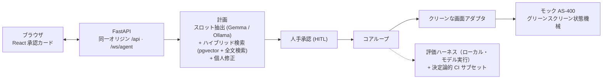

# Tanomude

[English](./README.md) · **日本語**

**まずは4つのページから**（インタラクティブモックは記録済みデータで動作し、**ライブ LLM ではありません**）：

1. **[Tanomude — 全体像](https://seunghwan-dev.github.io/tanomude/)** — 何を・なぜ（ナレッジ継承）・どう動くか・測定された裏づけ・アーキテクチャを1ページで通覧します。
2. **[インタラクティブモック](https://seunghwan-dev.github.io/tanomude/mock/)** — バックエンド不要・手書きの承認コンソールのインタラクティブモック。記録済みデータ上で承認フローをブラウザで体験できます。
3. **[実装状況とロードマップ](https://seunghwan-dev.github.io/tanomude/status/)** — 項目ごとの正直な実装台帳。実装済 73・部分実装 11・意図的延期 27・全 111 行で、延期項目も明示します。
4. **[設計と技術選定](https://seunghwan-dev.github.io/tanomude/operations/)** — 技術選定とその理由、コアループ・検索・評価ハーネスの実際の構造、そして運用設計 — 設計意図のみで、現時点で稼働しているものはありません。

---

自然言語の指示でレガシーなメインフレーム（グリーンスクリーン）系を操作する、人手承認（ヒューマン・イン・ザ・ループ）型のAIエージェント。完全オンプレミスで動作し、すべての操作は人の承認を経てから実行され、追記専用の監査証跡に記録されます。

**暗黙知の形式知化。** 製造業のレガシー基幹システムを支えてきた熟練オペレーターの退職が進むにつれ、グリーンスクリーンを「どう操作するか」という暗黙知も失われていきます。Tanomude はその知識を、取得した手順書に根拠づけながら自然言語として形式知化し、かつては熟練者を要した AS-400 風の業務を、平易な指示から実行・検証できるようにします。システム操作の領域におけるナレッジ継承（熟練技能の世代交代）への一つの答えです。

本プロジェクトは、本番運用を見据えた AI/LLM エンジニアリングとして一気通貫で構築しました。エージェントのコアループ・検索（RAG）・評価ハーネスのアーキテクチャ設計を担い、PoC → 実装 → 評価 → 運用のライフサイクル全体を通しています。改善は計測にもとづき（境界尊重をコード強制の不変条件として 0.25 → 1.0 に引き上げ、個人修正による育成は誇張せず 0.625 と正直に報告）、多層の品質ゲート（必須の CI `verify` チェック、`@claude` レビュー、複数段の QC）が守ります。独自ループの構築は、既存のエージェントフレームワークを安全性・検証要件に照らして評価したうえでの選択であり、すべての書き込みに人と検証を介在させています（実行前の承認、画面状態の検証、不一致時のロールバック）。

## インタラクティブデモ（モック）

バックエンド不要・手書きの承認コンソールのインタラクティブモック（**ライブ LLM ではありません**）。記録済みデータ上で承認フロー（指示 → 計画 → 承認／却下 → グリーンスクリーン再生）をブラウザで体験できます。

**[ライブモックを開く](https://seunghwan-dev.github.io/tanomude/mock/)**

> 範囲：モックは記録済みデータ上で承認・却下フローを示します。個人修正による学習ループ（修正が次の計画を作り直す挙動と、根拠づいたスロットへの修正を断る上書き不可の通知）は、このモックではなくフル機能のローカル製品で動作します。

> **デモ動画 — 近日公開**

---

## 概要

- **RAGエージェント** — 自然言語の依頼を、検索した手順書に根拠づけて具体的な計画に変換します。
- **評価ハーネス** — 計画・検索・ガードレールを、モデルを動かしてローカルで採点します。CI は決定論的なモデル非依存サブセット（lint・型チェック・ユニットテスト・フィクスチャ一致）を全PRで強制します。
- **ガードレール（LLMOps）** — モデルの応答はすべて検証付きの構造化出力契約であり、根拠づいた入力は修正では上書き不可とコードで保証する3階層の上書き優先順位で統制され、ドメイン外の指示は計画化せず却下します。
- **人手承認（HITL）** — 人の明示的な承認なしに、操作がレガシーシステムへ届くことはありません。ページを再読み込みしても承認カードは復元されます。
- **オンプレミス** — ローカルモデル（Ollama 上の Gemma）、ローカル埋め込み、ローカルDB。データは社外に出ません。
- **監査ログ** — 承認の判断、ステップ単位の実行タイムライン、修正履歴を永続化します。

## アーキテクチャ



エージェントは **提案** し、人が **決定** します。承認された計画だけが実行され、狭いアダプタ越しにキー単位でレガシーシステムへ再生されます。

## できること（測定値）

以下の数値は、評価ハーネスをモデルと埋め込みサービスとともにローカル実行した結果で、5回の同一フル実行で安定しています。CI はモデルを動かさず、決定論的なモデル非依存サブセット（lint・型チェック・ユニットテスト・ゴールデンフィクスチャ一致）をゲートします。モデル採点の評価を回帰ゲートへ昇格させることは、文書化済みの次の課題です。

| 観点 | 結果 |
|---|---|
| 計画 — 成功率・ルーティング・フィールド精度 | 1.0 |
| 検索 — recall@3・precision@expected・MRR | 1.0 |
| 個人修正による育成 — Δ（推論ティアの方針スロット） | 0.625 |
| 境界尊重 — 修正が根拠づいた入力を上書きしないこと | 1.0 |

> 検索の数値は評価の検索深度（k=3）で測定しています。本番の計画器はより深く（top-k 5〜6）根拠を取得するため、評価の動作点は本番とは異なります。

**上書きの統制方法。** 個人修正はモデルの *推論* スロットを動かせますが、依頼がすでに根拠づけている値を書き換えることはできません。この上書き不可は永続化された個人修正だけでなく修正（revise）操作にも及び、根拠づいたスロットを対象とする修正は、新しい指示でのやり直しを促す通知とともに反映されません。その選択はモデル任せではなく、スロットごとにコードで強制されます。目的地コードと目的（purpose）は修正では上書き不可で、依頼の根拠づいた入力に従い、修正では動かせません。海外フラグは、指示が根拠づける場合（例：国内／海外と明記された場合）のみ修正では上書き不可で、それ以外は可動の推論スロットです。前回案件の再利用は可動の推論スロットであり、修正が意図する対象です。

コードは値を生成しません。スロットはモデルが2回抽出し（根拠づいた文脈から1回、修正を適用して1回）、コードはスロットごとにモデル自身の出力のどちらを採用するかを選ぶだけです。したがって境界尊重はコードで強制される不変条件（1.0）であり、軟らかい確率ではありません。そして人手承認が最終防御です。モデルが何を提案しても、人が承認するまで実行されません。

**同じ複数回の実行から — 1.0 ではない数値も。** 個人修正による育成 Δ は 0.625。修正はすべてのケースでモデルへ到達することを確認済みで、reuse_prev_proj は方針4ケースすべてで動き、overseas の方針スロットは4ケース中1ケースで動きます。これは制御ベースライン（修正なしでは何も動かない）に対する8ケース中5ケースです。律速はモデルの曖昧スロットに対する判断であり、修正の配線ではありません。一時障害リカバリは 0.5。再計画・再実行が回復するのは一時的・環境側の障害のみで、不正な入力データは設計上、盲目的に再試行せず人へ引き渡します（下記の再入力・要調査の経路）。verify 通過は 0.667 — verify の不一致は検知イベントであり、黙った誤送信ではなくロールバックと再計画をトリガーします。precision@3 は 0.5 で、期待集合が 3 未満でも k=3 で割ることによる構造上のアーティファクトです。同じ実行の precision@expected は 1.0。実行あたりの平均ステップ数は 9.56 です。

## クイックスタート

```bash
git clone <repo>
cd tanomude
docker compose up
```

その後 **http://localhost:8000** を開きます。

> 初回起動はコンテナイメージのビルド・取得と2つのローカルモデル — LLM（約10GB）と埋め込みモデル（約2.2GB）、合計約12GB — のダウンロードを含みます。所要時間は回線速度に依存し、高速回線で約10〜15分（埋め込みモデルのダウンロードが最も遅い区間になりがちです）、低速回線ではそれ以上かかります。以降はキャッシュされます。

## 正直な結果表示

実行は4つの状態のいずれかに解決し、タイムラインに率直に表示されます。

- **送信済** — レコードが作成され、タイムラインにその ID を表示します。
- **再入力/コード確認** — 入力されたコードがレガシーシステムの検証を通らず、確認と再入力が必要です。
- **要調査** — 一時的・実行環境側の事象で、リトライを尽くした場合です。この第4の状態は一時的な環境障害で発生し、一時障害用の評価スイートで実証しています。
- **却下** — 申請が不備、規程外、またはドメイン外の場合です。出張申請でない指示は、計画化せず新入社員の文言「すみません、このご依頼はまだ分かりません。今は出張申請の操作のみお手伝いできます。」で断ります。理由を表示します。

## 育成は「2つの数値」で

ユーザーごとの育成は意図的に **2つ** の指標で報告します。**育成デルタ**（個人修正が実際にモデルの判断を動かすか）と、**境界尊重**（その修正が、上書きしてはならない入力に踏み込まないか）です。前者だけを示せば、後者が隠れてしまいます。

このループは出荷UIで稼働しています。操作者が修正メモ付きで 却下 または 修正 を行うと、個人修正が永続化され、同じ目的地に対する次回の計画に反映されます。

## ロードマップ

「生きているプロジェクト」です。次の予定:

- 依頼の目的を独立したフォーム欄に昇格し、決定論的に固定して、明示入力の境界を強化する。
- 検証コードに基づく、フィールド単位の再入力ガイドメッセージ。
- 実際の手順書を取り込み、「修正が手順書ルールに勝つ」ことを測定する。
- コンテナスタック全体の継続的インテグレーション・スモークテスト。
- モデル採点の評価スイートを CI 回帰ゲートへ昇格する（現在はローカル実行で、CI はモデル非依存サブセットのみをゲート）。

## 内部の仕組み

操作対象は、グリーンスクリーンの AS-400 風ワークフローを決定論的な状態機械としてモデル化したもので、エージェントがクリーンなアダプタ越しにキー単位で操作します。その上で動くのがコンピュータ操作ループ — 画面読み取り → キー提案 → 状態検証 — で、画面が食い違えば再計画とロールバックを行い、不正な入力データは盲目的にリトライせず人へ引き渡すショートサーキットを備えます。

## ライセンス

MIT — [LICENSE](./LICENSE) を参照。
