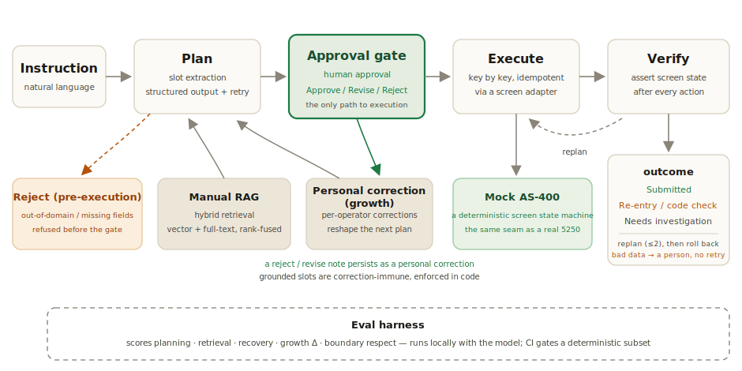

# Tanomude

**English** · [日本語](./README.ja.md)

**The project, on five readable pages** (the interactive mock runs on recorded data — **not a live LLM**):

1. **[Tanomude at a glance](https://seunghwan-dev.github.io/tanomude/)** — the through-line on one page: what it is, why (ナレッジ継承), how it works, and the measured proof.
2. **[Interactive mock](https://seunghwan-dev.github.io/tanomude/mock/)** — a no-backend, hand-authored interactive mock of the approval console; walk the approval flow on recorded data, right in the browser.
3. **[Status & roadmap](https://seunghwan-dev.github.io/tanomude/status/)** — the honest implementation ledger, item by item: 73 implemented · 11 partial · 27 deferred by decision, 111 rows, with the deferred items openly marked.
4. **[Design & technology choices](https://seunghwan-dev.github.io/tanomude/operations/)** — the engineering decisions and their reasons, the architecture overview, the real structure of the core loop, retrieval, and eval harness, and the operations design — design intent only; none of it is running today.
5. **[Productization](https://seunghwan-dev.github.io/tanomude/productization/)** — the go-to-market thinking (experiential marketing at manufacturing trade shows); the strategy and development plan in progress.

---

A human-in-the-loop AI agent that operates legacy mainframe (green-screen) systems through natural language — fully on-premises, with every action gated by human approval and recorded in an append-only audit trail.

**Encoding tacit operational knowledge.** The veterans who operate manufacturing's legacy back-office systems are retiring, and the knowledge of *how* to drive those green screens leaves with them. Tanomude turns that tacit know-how into explicit natural-language instructions, grounded in the retrieved operating manuals, so an AS-400-style workflow that once required a seasoned operator can be carried out — and verified — from a plain instruction. It is a system-operation answer to the skilled-worker succession problem (ナレッジ継承).

The project is built end-to-end as production AI/LLM engineering. It owns the architecture of the agent core loop, retrieval, and eval harness, and carries it through the full PoC → implementation → evaluation → operation lifecycle. It improves by measurement (boundary respect raised from 0.25 to a code-enforced 1.0; per-user growth reported honestly at 0.625, not rounded up) under layered quality gates: a required CI `verify` check, `@claude` review, and multi-pass QC. The custom agent loop was built only after weighing existing frameworks against these safety and verification needs, and a person and a check stay on every write — approval before execution, screen-state verification, and rollback on mismatch.

## Interactive demo (mock)

A no-backend, hand-authored interactive mock of the approval console — **not a live LLM**. Walk the approval flow (instruction → plan → approve / reject → green-screen replay) on recorded data, right in the browser:

**[Open the live mock](https://seunghwan-dev.github.io/tanomude/mock/)**

> Scope: the mock demonstrates the approval and refusal flow on recorded data. The correction-learning loop — a 修正 (revise) reshaping the next plan, and the immunity notice that declines a revise aimed at a grounded slot — runs in the full local product, not in this mock.

> **Demo video** — a recorded demo run plays on the landing page (mock data).

---

## At a glance

- **RAG agent** — turns a natural-language request into a concrete plan, grounded in retrieved operating manuals.
- **Eval harness** — an in-repo suite scores planning, retrieval, and guardrails when run locally with the model; CI enforces a deterministic, model-free subset (lint, type-check, unit tests, fixture parity) on every pull request.
- **Guardrails (LLMOps)** — every model response is a validated structured-output contract, governed by a three-tier override hierarchy that keeps grounded input correction-immune in code, and an out-of-domain instruction is refused rather than forced into a plan.
- **Human-in-the-loop** — nothing reaches the legacy system without an explicit human approval; the approval card is restored if the page is reloaded.
- **On-premises** — local model (Gemma via Ollama), local embeddings, local databases. Nothing leaves the building.
- **Audit log** — approval decisions, the step-by-step execution timeline, and correction history are persisted.

## Stack

LLM (Gemma 4 via Ollama) · RAG (hybrid retrieval) · pgvector + Postgres · multilingual-e5 embeddings (TEI) · FastAPI · React/Vite · Docker Compose

## Key engineering

- **grounded-slot immunity** — corrections move inference slots only; request-grounded slots are code-enforced immune (boundary_respect = 1.0)
- **per-operator correction / growth loop** — learning from reject/revise notes, no retraining
- **screen-adapter seam** — a narrow interface isolating the legacy terminal (mock ↔ real 5250)
- **idempotent execution** — duplicate-submit safety (task_id + DB unique constraint)
- **eval harness** — the measurement that keeps the claims honest

## Architecture

<picture>
  <source media="(prefers-color-scheme: dark)" srcset="./docs/architecture-en-dark.svg">
  
</picture>

The agent **proposes**; a human **decides**. Only approved plans execute, replayed key-by-key through a narrow screen adapter against the legacy system.

## What it does, measured

Every number below comes from running the in-repo eval harness locally with the model and the embedding service, and is stable across five identical full runs. CI does not run the model: it gates a deterministic, model-free subset (lint, type-check, unit tests, and golden-fixture parity). Promoting the model-scored eval into a regression gate is a documented next step.

| Dimension | Result |
|---|---|
| Planning — success · routing · field accuracy | 1.0 |
| Retrieval — recall@3 · precision@expected · MRR | 1.0 |
| Personal-correction growth — Δ (inference-tier policy slots) | 0.625 |
| Boundary respect — correction must not override grounded input | 1.0 |

> Retrieval figures are measured at the eval's retrieval depth (k=3); the serving planner grounds deeper (top-k 5–6), so the eval operating point differs from serving.

**How overrides are governed.** A personal correction may move the model's *inference* slots, but it cannot rewrite what the request already grounds — and the same immunity now covers the 修正 (revise) gesture, not only persisted corrections, so a revise aimed at a grounded slot is declined with a notice directing the operator to issue a new instruction. That choice is enforced in code, slot by slot, not left to the model. Destination code and purpose are correction-immune: they follow the request's grounded input, and a correction cannot move them. Overseas is immune only when the instruction grounds it (e.g. it states domestic or overseas); otherwise it is a movable inference slot. Reuse-previous-project is a movable inference slot — the intended target of a correction.

The code never invents a value. Slots are extracted by the model twice — once from the grounded context and once with the correction applied — and the code only selects which of the model's own outputs to trust per slot. So boundary respect is a code-enforced invariant (1.0), not a soft probability. Human approval is the final defense: whatever the model proposes, nothing executes until a person approves it.

**Also from the same runs — the numbers that are not 1.0.** Personal-correction growth Δ is 0.625: corrections are verified to reach the model in every case; `reuse_prev_proj` moves on all four policy cases and the `overseas` policy slot on one of four — five of eight, against a zero control baseline (nothing moves without a correction). The limiter is the model's judgment on the ambiguous slot, not the correction plumbing. Recovery on transient faults is 0.5: replan-and-replay recovers transient, environment-side failures only; by design, bad input data is not retried blindly but short-circuited to a human (the re-entry / needs-investigation paths below). Verify pass is 0.667 — a failed verify is a detection event: it triggers rollback and replan instead of a silent wrong submit. precision@3 is 0.5, a structural artifact of fixed k=3 against expected sets smaller than 3; precision@expected on the same run is 1.0. An executed run averages 9.56 steps.

## Quickstart

```bash
git clone <repo>
cd tanomude
docker compose up
```

Then open **http://localhost:8000**.

> First run builds and pulls the container images and downloads two local models — the LLM (around 10 GB) and the embedding model (~2.2 GB), about 12 GB total. Timing is network-dependent: roughly 10–15 minutes on a fast connection (the embedding-model download is often the slowest leg), longer on slower links. They are cached afterward.

## Honest outcomes

Execution resolves to one of four states, surfaced plainly on the timeline:

- **Submitted** — the record was created; the timeline shows its id.
- **Re-entry / code check (再入力/コード確認)** — a typed code failed the legacy system's validation; the operator checks and re-enters it.
- **Needs investigation (要調査)** — retries were exhausted on a transient, environment-side condition. This fourth state arises on transient environment faults and is exercised by the transient-fault eval suite.
- **Refused** — the request was incomplete, out of policy, or out of domain. An instruction that is not a trip request is declined with the new-employee message 「すみません、このご依頼はまだ分かりません。今は出張申請の操作のみお手伝いできます。」 rather than being forced into a plan; the reason is shown.

## Growth, as two separate numbers

Per-user growth is reported as **two** metrics on purpose: a **growth delta** (does a personal correction actually move the model's decision?) and **boundary respect** (does that correction stay out of the inputs it must not override?). Reporting only the first would hide the second.

The loop is live in the shipped UI: an operator's 却下 (reject) or 修正 (revise) with a correction note persists a personal correction that shapes the next plan for the same destination.

## Roadmap

A living project. Next up:

- Promote the request's purpose to a discrete form field with a deterministic pin, hardening the explicit-input boundary.
- Per-field re-entry guidance driven by the validation codes.
- Ingest real operating manuals and measure "a correction beats the manual rule" on them.
- A continuous-integration smoke test of the full container stack.
- Promote the model-scored eval suite into a CI regression gate (today it runs locally; CI gates only the model-free subset).

## Under the hood

The legacy target is a green-screen AS-400-style workflow, modeled as a deterministic state machine that the agent drives key-by-key through a clean adapter seam. Over it runs a computer-use loop — read screen → propose keys → assert state — with replan-and-rollback when the screen disagrees, and a short-circuit that hands bad input data to a human instead of retrying blindly.

## License

MIT — see [LICENSE](./LICENSE).
