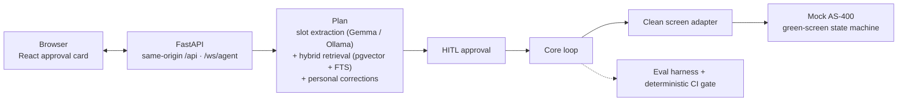

# Tanomude

**English** · [日本語](./README.ja.md)

A human-in-the-loop AI agent that operates legacy enterprise systems through natural language — fully on-premises, with every action gated by human approval and recorded in an append-only audit trail.

> **Demo video — coming soon**

---

## At a glance

- **RAG agent** — turns a natural-language request into a concrete plan, grounded in retrieved operating manuals.
- **Eval harness** — an in-repo suite scores planning, retrieval, and guardrails; a deterministic subset runs as a required check on every pull request.
- **Guardrails (LLMOps)** — every model response is a validated structured-output contract, governed by a three-tier override hierarchy that keeps grounded input correction-immune in code, and an out-of-domain instruction is refused rather than forced into a plan.
- **Human-in-the-loop** — nothing reaches the legacy system without an explicit human approval; the approval card is restored if the page is reloaded.
- **On-premises** — local model (Gemma via Ollama), local embeddings, local databases. Nothing leaves the building.
- **Audit log** — approval decisions, the step-by-step execution timeline, and correction history are persisted.

## Architecture



The agent **proposes**; a human **decides**. Only approved plans execute, replayed key-by-key through a narrow screen adapter against the legacy system.

## What it does, measured

Every number below comes from the in-repo eval harness (with the embedding service) and is stable across five identical full runs; a deterministic subset of that suite gates every pull request.

| Dimension | Result |
|---|---|
| Planning — success · routing · field accuracy | 1.0 |
| Retrieval — recall@3 · precision@expected · MRR | 1.0 |
| Personal-correction growth — Δ (inference-tier policy slots) | 0.625 |
| Boundary respect — correction must not override grounded input | 1.0 |

> Retrieval figures are measured at the eval's retrieval depth (k=3); the serving planner grounds deeper (top-k 5–6), so the eval operating point differs from serving.

**How overrides are governed.** A personal correction may move the model's *inference* slots, but it cannot rewrite what the request already grounds — and that choice is enforced in code, slot by slot, not left to the model:

- **Destination code and purpose are correction-immune.** They follow the request's grounded input; a correction cannot move them.
- **Overseas is immune only when the instruction grounds it** (e.g. it states domestic or overseas); otherwise it is a movable inference slot.
- **Reuse-previous-project is a movable inference slot** — the intended target of a correction.
- **The code never invents a value.** Slots are extracted by the model twice — once from the grounded context and once with the correction applied — and the code only selects which of the model's own outputs to trust per slot. So **boundary respect is a code-enforced invariant (1.0)**, not a soft probability.
- **Human approval is the final defense.** Whatever the model proposes, nothing executes until a person approves it.

**Also from the same runs — the numbers that are not 1.0.**
- **Personal-correction growth Δ 0.625** — corrections are verified to reach the model in every case; `reuse_prev_proj` moves on all four policy cases and the `overseas` policy slot on one of four — five of eight, against a zero control baseline (nothing moves without a correction). The limiter is the model's judgment on the ambiguous slot, not the correction plumbing.
- **Recovery (transient faults) 0.5** — replan-and-replay recovers transient, environment-side failures only; by design, bad input data is not retried blindly but short-circuited to a human (the re-entry / needs-investigation paths below).
- **Verify pass 0.667** — a failed verify is a detection event: it triggers rollback and replan instead of a silent wrong submit.
- **precision@3 0.5** — a structural artifact of fixed k=3 against expected sets smaller than 3; precision@expected on the same run is 1.0.
- **Average steps per successful run: 9.56.**

## Quickstart

```bash
git clone <repo>
cd tanomude
docker compose up
```

Then open **http://localhost:8000**.

> First run builds the images and downloads two local models — the LLM (~9.6 GB) and the embedding model (~2.2 GB), about 12 GB total — so allow roughly 10 minutes on a fast connection, longer on slower links. They are cached afterward.

## Honest outcomes

Execution resolves to one of four states, surfaced plainly on the timeline:

- **Submitted** — the record was created; the timeline shows its id.
- **Re-entry / code check (再入力/コード確認)** — a typed code failed the legacy system's validation; the operator checks and re-enters it.
- **Needs investigation (要調査)** — retries were exhausted on a transient, environment-side condition. This fourth state arises on transient environment faults and is exercised by the transient-fault eval suite.
- **Refused** — the request was incomplete, out of policy, or out of domain. An instruction that is not a trip request is declined with the new-employee message 「すみません、このご依頼はまだ分かりません。今は出張申請の操作のみお手伝いできます。」 rather than being forced into a plan; the reason is shown.

## Growth, as two separate numbers

Per-user growth is reported as **two** metrics on purpose: a **growth delta** (does a personal correction actually move the model's decision?) and **boundary respect** (does that correction stay out of the inputs it must not override?). Reporting only the first would hide the second.

The loop is live in the shipped UI: an operator's 却下 (reject) or 修正 (revise) with a correction note persists a personal correction that shapes the next plan for the same destination.

## Roadmap

A living project. Next up:

- Promote the request's purpose to a discrete form field with a deterministic pin, hardening the explicit-input boundary.
- Per-field re-entry guidance driven by the validation codes.
- Ingest real operating manuals and measure "a correction beats the manual rule" on them.
- A continuous-integration smoke test of the full container stack.

## Under the hood

- **Legacy target** — a green-screen AS-400-style workflow, modeled as a deterministic state machine that the agent drives key-by-key through a clean adapter seam.
- **Computer-use loop** — read screen → propose keys → assert state, with replan-and-rollback when the screen disagrees, and a short-circuit that hands bad input data to a human instead of retrying blindly.

## License

MIT — see [LICENSE](./LICENSE).
