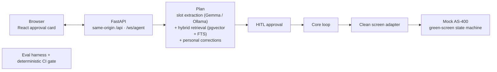

# Tanomude

**English** · [日本語](./README.ja.md)

A human-in-the-loop AI agent that operates legacy enterprise systems through natural language — fully on-premises, with every action gated by human approval and recorded in an append-only audit trail.

> **Demo video — coming soon**

Built on [OpenClaw](https://github.com/openclaw/openclaw).

---

## At a glance

- **RAG agent** — turns a natural-language request into a concrete plan, grounded in retrieved operating manuals.
- **Eval harness** — an in-repo suite scores planning, retrieval, and guardrails; a deterministic subset runs as a required check on every pull request.
- **Guardrails (LLMOps)** — every model response is a validated structured-output contract, governed by a three-tier override hierarchy with measured boundary tests.
- **Human-in-the-loop** — nothing reaches the legacy system without an explicit human approval.
- **On-premises** — local model (Gemma via Ollama), local embeddings, local databases. Nothing leaves the building.
- **Audit log** — approval decisions, the step-by-step execution timeline, and correction history are persisted.

## Architecture



The agent **proposes**; a human **decides**. Only approved plans execute, replayed key-by-key through a narrow screen adapter against the legacy system.

## What it does, measured

Every number below comes from a full run of the in-repo eval harness (with the embedding service); a deterministic subset of that suite gates every pull request.

| Dimension | Result |
|---|---|
| Planning — success · routing · field accuracy | 1.0 |
| Retrieval — recall@3 · precision@expected · MRR | 1.0 |
| Personal-correction growth — Δ (inference-tier policy slots) | +1.0 |
| Boundary respect — correction must not override grounded input | 0.75 |

**How overrides are governed.** Inputs resolve in a three-tier order — **explicit input → personal correction → manual-rule / inferred default** — and the boundary between them is measured, not asserted:

- **A structured field is hard.** A value the operator typed into a form field is authoritative.
- **A mention buried in free-text instruction is soft** — honored when plausible, but a personal correction can still move it. That is where the honest 0.75 comes from: not every soft case holds.
- **Human approval is the final defense.** Whatever the model proposes, nothing executes until a person approves it.

## Quickstart

```bash
git clone <repo> && cd tanomude
docker compose up
```

Then open **http://localhost:8000**.

> First run builds the images and downloads the local model (~9.6 GB), so allow roughly 10 minutes on a fast connection — longer on slower links. It is cached afterward.

### Honest outcomes

Execution resolves to one of four states, surfaced plainly on the timeline:

- **Submitted** — the record was created; the timeline shows its id.
- **Re-entry / code check (再入力 / コード確認)** — a typed code failed the legacy system's validation; the operator checks and re-enters it.
- **Needs investigation (要調査)** — retries were exhausted on a transient, environment-side condition.
- **Refused** — the request was incomplete or out of policy; the reason is shown.

### Growth, as two separate numbers

Per-user growth is reported as **two** metrics on purpose: a **growth delta** (does a personal correction actually move the model's decision?) and **boundary respect** (does that correction stay out of the inputs it must not override?). Reporting only the first would hide the second.

## Roadmap

A living project. Next up:

- Promote the request's purpose to a discrete form field with a deterministic pin, hardening the explicit-input boundary.
- Per-field re-entry guidance driven by the validation codes.
- Ingest real operating manuals and measure "a correction beats the manual rule" on them.
- A continuous-integration smoke test of the full container stack.

## Under the hood

- **Legacy target** — a green-screen AS-400-style workflow, modeled as a deterministic state machine that the agent drives key-by-key through a clean adapter seam.
- **Computer-use loop** — read screen → propose keys → assert state, with replan-and-rollback when the screen disagrees, and a short-circuit that hands bad input data to a human instead of retrying blindly.
